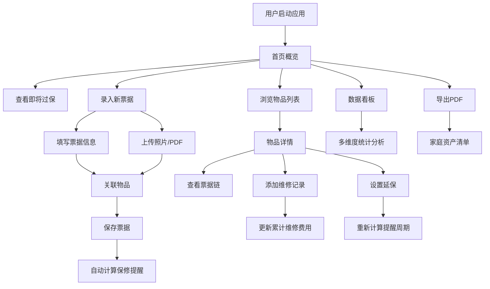

## 1. 产品概述
家庭纸质票据收纳与保修单据管理助手，帮助家庭集中管理购物小票、电子发票、保修卡与说明书，实现保修到期智能提醒、维修记录跟踪、资产统计与PDF导出等全生命周期管理。

- 解决家庭票据分散、保修过期遗忘、维修记录缺失等痛点
- 目标用户为有家庭资产管理需求的用户，特别是家电、数码产品较多的家庭
- 产品价值：纸质票据数字化、保修提醒智能化、家庭资产可视化

## 2. 核心 Features

### 2.1 用户角色
| 角色 | 注册方式 | 核心权限 |
|------|----------|----------|
| 家庭用户 | 无需注册，本地存储 | 票据录入、浏览、搜索、提醒管理、维修记录、数据统计、PDF导出 |

### 2.2 Feature Module
1. **首页**：即将过保物品倒计时、快捷操作入口、数据概览卡片
2. **票据管理**：票据录入、上传、分类浏览、关键词搜索、票据链关联
3. **物品管理**：物品录入、分类管理、保修周期管理、延保设置
4. **维修记录**：维修时间线、费用累计、配件更换记录
5. **说明书库**：说明书上传、分类浏览、在线预览
6. **数据看板**：多维度统计图表、趋势分析、排行展示
7. **导出中心**：物品清单导出、票据信息导出为PDF

### 2.3 Page Details
| 页面名称 | 模块名称 | Feature 描述 |
|---------|----------|--------------|
| 首页 | 即将过保提醒 | 30天/7天/3天三阶段倒计时卡片，已过保灰色标记 |
| 首页 | 快捷操作 | 快速录入票据、快速添加物品、批量上传入口 |
| 首页 | 数据概览 | 在保数量、本月新增票据、累计金额、即将到期数量 |
| 票据列表 | 筛选器 | 按类型（小票/发票/保修卡/说明书/合同/证书/维修单）、按关联物品筛选 |
| 票据列表 | 搜索 | 关键词搜索票据名称、物品名称、品牌型号 |
| 票据详情 | 票据信息 | 完整信息展示，关联物品跳转，文件预览 |
| 票据录入 | 表单 | 名称、类型、物品关联、日期、价格、渠道、保修截止、文件上传 |
| 物品列表 | 分类展示 | 按家电/数码/家具/汽车等类别分组 |
| 物品详情 | 票据链 | 展示该物品所有关联票据（发票、保修卡、说明书、维修单） |
| 物品详情 | 保修信息 | 保修期展示、延保设置、提醒周期重新计算 |
| 物品详情 | 维修时间线 | 历次维修记录时间线展示，累计费用统计 |
| 维修记录 | 录入表单 | 故障描述、维修方式、费用、更换配件、日期 |
| 说明书库 | 分类浏览 | 按物品分类展示说明书，支持PDF/图片在线预览 |
| 数据看板 | 统计图表 | 在保/过保数量统计、类别金额分布、维修费用月度趋势、最费钱物品排行 |
| 导出中心 | PDF导出 | 物品清单附带票据关键信息导出，支持筛选导出范围 |

## 3. Core Process

### 3.1 票据录入流程
用户点击录入票据 → 选择票据类型 → 填写基本信息 → 关联物品（或新建）→ 上传照片/PDF（支持拍照）→ 保存 → 自动计算保修提醒

### 3.2 保修提醒流程
系统每日检查保修截止日期 → 标记30天内到期（橙色）→ 标记7天内到期（红色）→ 标记3天内到期（闪烁红色）→ 已过保标记为灰色 → 首页突出展示

### 3.3 维修记录流程
进入物品详情 → 添加维修记录 → 填写故障与费用 → 上传维修单据 → 保存 → 自动累计维修费用 → 更新时间线

### 3.4 Mermaid Flowchart

## 4. User Interface Design

### 4.1 Design Style
- **设计风格**：现代简约、专业可信、温暖居家风格
- **主色调**：深青色 #0F766E（专业、可信）
- **辅助色**：琥珀色 #F59E0B（提醒）、玫瑰色 #F43F5E（紧急）、翠绿色 #10B981（正常）
- **中性色**：石板灰系列，白色背景，深色文字
- **按钮风格**：圆润边角（8px），轻微阴影，悬停上浮动效
- **字体**：标题使用 Noto Serif SC（温暖人文感），正文使用 Noto Sans SC（清晰易读）
- **布局**：卡片式布局，左侧导航栏 + 主内容区
- **图标**：lucide-react 线性图标，统一风格

### 4.2 Page Design Overview
| 页面名称 | 模块名称 | UI 元素 |
|---------|----------|---------|
| 首页 | 即将过保卡片 | 倒计时数字动画、颜色分级（绿/橙/红）、悬停放大效果 |
| 首页 | 数据概览 | 渐变色卡片、图标+数字+趋势箭头组合 |
| 票据列表 | 卡片网格 | 悬停阴影加深、类型标签彩色区分、缩略图展示 |
| 物品详情 | 票据链 | 时间轴样式、节点图标、连接线动画 |
| 物品详情 | 维修时间线 | 垂直时间线、费用高亮、累计金额统计 |
| 数据看板 | 图表区 | 渐变填充柱状图、环形图、平滑折线图、动画加载 |
| 表单页 | 录入表单 | 分段式表单、浮动标签、实时校验、文件拖拽上传 |

### 4.3 Responsiveness
- 桌面优先设计，支持平板和移动端自适应
- 大屏：左侧固定导航栏，主内容区最大宽度1400px
- 平板：导航栏可折叠，内容区两列布局
- 移动端：底部Tab导航，单列卡片布局，触控优化（点击区域≥44px）

### 4.4 Animation & Interaction
- 页面加载：元素渐入 + 轻微上移动画
- 卡片悬停：阴影加深 + 微上浮（transform: translateY(-2px)）
- 倒计时：数字跳动动画，临近到期时脉冲效果
- 表单提交：成功后绿色对勾动画
- 模态框：背景模糊 + 缩放进入
