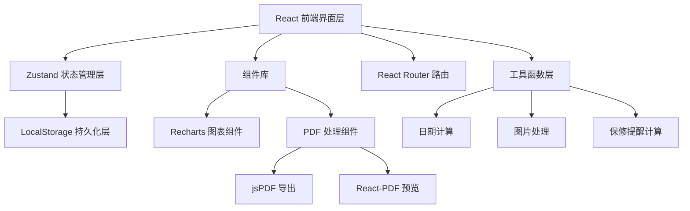

## 1. Architecture Design



纯前端单页应用架构，数据完全存储在浏览器 LocalStorage 中，无需后端服务。

## 2. Technology Description

- **前端框架**: React@18 + TypeScript + Vite@5
- **状态管理**: Zustand@4
- **路由**: react-router-dom@6
- **样式**: Tailwind CSS@3
- **UI 组件**: lucide-react（图标）+ 自定义组件
- **图表库**: recharts@2
- **PDF 导出**: jspdf@2 + html2canvas@1
- **PDF 预览**: react-pdf@7
- **日期处理**: date-fns@3
- **图片处理**: 原生 Canvas API（实现拍照裁剪边框）
- **初始化工具**: vite-init

## 3. Route Definitions

| Route | 页面 | 用途 |
|-------|------|------|
| `/` | 首页 | 即将过保提醒、数据概览、快捷操作 |
| `/receipts` | 票据列表 | 票据浏览、筛选、搜索 |
| `/receipts/new` | 票据录入 | 新增票据表单 |
| `/receipts/:id` | 票据详情 | 票据信息展示与编辑 |
| `/items` | 物品列表 | 物品分类浏览 |
| `/items/new` | 物品录入 | 新增物品表单 |
| `/items/:id` | 物品详情 | 物品信息、票据链、维修记录 |
| `/manuals` | 说明书库 | 说明书分类浏览与预览 |
| `/dashboard` | 数据看板 | 多维度统计图表 |
| `/export` | 导出中心 | PDF导出配置与下载 |

## 4. Data Model

### 4.1 ER Diagram


### 4.2 TypeScript Type Definitions

```typescript
export type ReceiptType = 'receipt' | 'invoice' | 'warranty' | 'manual' | 'contract' | 'certificate' | 'repair';
export type ItemCategory = 'appliance' | 'digital' | 'furniture' | 'car' | 'other';
export type WarrantyStatus = 'active' | 'expiring-30' | 'expiring-7' | 'expiring-3' | 'expired';

export interface Item {
  id: string;
  name: string;
  category: ItemCategory;
  brand: string;
  model: string;
  purchaseDate: string;
  purchaseChannel: string;
  price: number;
  warrantyEndDate: string;
  originalWarrantyEndDate?: string;
  notes?: string;
  createdAt: string;
  updatedAt: string;
}

export interface Receipt {
  id: string;
  name: string;
  type: ReceiptType;
  itemId?: string;
  issueDate: string;
  amount: number;
  merchant: string;
  warrantyEndDate?: string;
  description?: string;
  fileIds: string[];
  createdAt: string;
  updatedAt: string;
}

export interface Repair {
  id: string;
  itemId: string;
  repairDate: string;
  faultDescription: string;
  repairMethod: string;
  cost: number;
  replacedParts: string;
  notes?: string;
  receiptId?: string;
  createdAt: string;
}

export interface FileAttachment {
  id: string;
  receiptId?: string;
  manualId?: string;
  name: string;
  type: 'image' | 'pdf';
  dataUrl: string;
  size: number;
  createdAt: string;
}

export interface WarrantyExtension {
  id: string;
  itemId: string;
  originalEndDate: string;
  newEndDate: string;
  reason: string;
  cost: number;
  createdAt: string;
}
```

## 5. Project Structure

```
src/
├── components/          # 通用组件
│   ├── layout/         # 布局组件（Sidebar、Header、MobileNav）
│   ├── ui/             # 基础UI组件（Button、Card、Input、Modal）
│   ├── forms/          # 表单组件（ReceiptForm、ItemForm、RepairForm）
│   └── charts/         # 图表组件
├── pages/              # 页面组件
│   ├── Home.tsx
│   ├── ReceiptList.tsx
│   ├── ReceiptDetail.tsx
│   ├── ReceiptNew.tsx
│   ├── ItemList.tsx
│   ├── ItemDetail.tsx
│   ├── ItemNew.tsx
│   ├── Manuals.tsx
│   ├── Dashboard.tsx
│   └── Export.tsx
├── store/              # Zustand 状态管理
│   ├── useItemStore.ts
│   ├── useReceiptStore.ts
│   ├── useRepairStore.ts
│   └── useFileStore.ts
├── hooks/              # 自定义 Hooks
│   ├── useWarrantyStatus.ts
│   ├── useCameraCapture.ts
│   └── useLocalStorage.ts
├── utils/              # 工具函数
│   ├── date.ts
│   ├── warranty.ts
│   ├── pdf.ts
│   ├── image.ts
│   └── export.ts
├── types/              # 类型定义
│   └── index.ts
├── data/               # Mock 数据
│   └── mockData.ts
├── App.tsx
├── main.tsx
└── index.css
```

## 6. 核心功能实现方案

### 6.1 保修提醒计算
- 页面加载时计算所有物品的保修状态
- 根据当前日期与 `warrantyEndDate` 差值确定状态：
  - >30天：active（绿色）
  - 7-30天：expiring-30（橙色）
  - 3-7天：expiring-7（红色）
  - 0-3天：expiring-3（闪烁红色）
  - <0天：expired（灰色）

### 6.2 图片裁剪功能
- 使用 `getUserMedia` 调用摄像头拍照
- Canvas API 实现简单的边框检测与裁剪
- 支持手动调整裁剪区域

### 6.3 PDF 导出
- 使用 `jspdf` + `html2canvas` 生成PDF
- 支持导出物品清单，包含：物品名称、品牌型号、购买日期、价格、保修状态、关联票据数量
- 导出A4格式，支持中文显示

### 6.4 数据持久化
- 使用 LocalStorage 存储所有数据
- Zustand store 自动同步到 LocalStorage
- 提供数据导入/导出功能（JSON格式）
